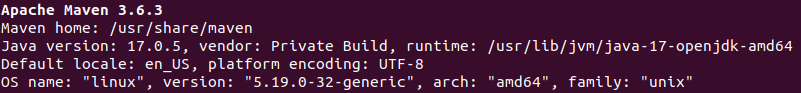

# INFOM124-STUDENTS

## Practical courses - 2024-2025

This repository contains the JPacman project that will be used during the practical courses of "INFOM124 - Vérification et validation logicielle"

## Requirements

All the requirements discussed in this section refer to Linux or macOS distributions. If you are on Windows 10, you can install a Linux kernel so that you can use the same command lines as Linux or macOS, by following [this tutorial](https://www.ssl.com/fr/comment/activer-le-sous-syst%C3%A8me-linux-installer-ubuntu-windows-10/).

### Java

JDK 17 (or openJDK 17) or newer JDK version is required for this project. Here are the steps of installation of openJDK 17 on Linux and macOS distributions (for Windows, see [this tutorial](https://java.tutorials24x7.com/blog/how-to-install-openjdk-17-on-windows)).

Installation:

```console
sudo apt update
sudo apt install openjdk-17-jdk openjdk-17-jre
```

Check the successful installation:

```console
java --version
```

If the returned version is openjdk 17, the installation is complete!

### Maven

This project uses Maven. The installation of Maven is not mandatory but you can do it if you want.

> "Apache Maven is a software project management and comprehension tool. Based on the concept of a project object model (POM), Maven can manage a project's build, reporting and documentation from a central piece of information."
> -- <cite>[Apache Maven website](https://maven.apache.org/)</cite>

Maven should be installed on your computer. There are two possibilities:

1. Command line: check the [Maven website](https://maven.apache.org/install.html) (or [this tutorial for Windows](https://phoenixnap.com/kb/install-maven-windows)) for installation.
2. Maven integration with your IDE: check in function of the IDE you use

After the installation is complete, run:

```console
mvn -v
```

The result should be similar to the image below. Make sure the Java version is 17!


## Revision control

Each student will work on the codebase on a forked repository of this one. We expect you to follow these best practices during the courses:

- **Make sure you commit frequently**: commit at least once, but possibly more often per exercise!
- **Write clear commit messages**: your commit messages should serve as a summary of the changes you made.
- **Use branches**: you'll get most benefit from git if you also use branches, for example one branch for every exercise.
- **Use pull requests** and avoid committing to master directly.

Each pull request will be reviewed by another student before merging into main. Following the best practices on your work will help the reviewer to make a good review of your work.

## Acknowledgements

This project is based on the TUDelft [JPacman-Framework project](https://github.com/SERG-Delft/jpacman-framework), mainly created by Arie van Deursen and Jeroen Roosen.
